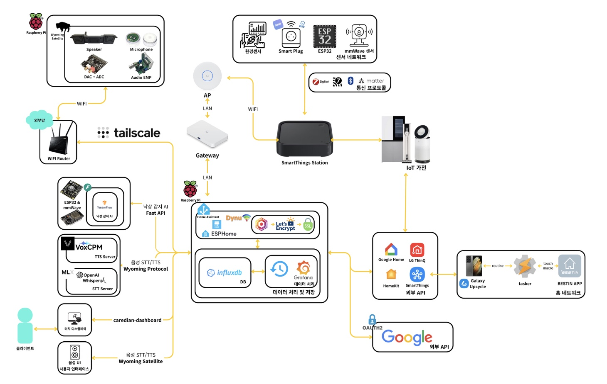

# 2025ESWContest_smart_kossmetheus

# 🏠 CareDian: 스마트 홈 통합 관리 시스템

## 📘 프로젝트 개요

CareDian은 고령자·1인가구·소형가구에서도 **누구나 쉽게 쓰는 스마트홈**을 목표로 합니다.  
Home Assistant를 허브로 삼아 LG ThinQ, SmartThings, HomeKit, Zigbee/Matter, ESPHome 등의 생태계를 통합하여  
음성 중심의 직관적 인터랙션과 mmWave 기반 낙상 감지를 결합한 **안전·편의 통합 플랫폼**입니다.


---

## 💡 개발 배경 및 동기

- 제조사·플랫폼별로 제각각인 제어 체계는 사용자에게 복잡한 설정과 높은 진입장벽을 초래합니다.  
- 카메라 중심 감시는 프라이버시 우려와 설치 부담으로 실제 도입이 어렵습니다.  
- 고령자와 1인가구의 안전과 접근성을 고려한 “**상호운용성 중심의 음성 인터페이스**”가 필요합니다.

이에 CareDian은 다음을 실현합니다.

> **누구나 이해하고 즉시 쓸 수 있는 연결**  
> - 표준화된 기기 제어 (Zigbee/Matter/ESPHome 등)  
> - 음성 기반 인터랙션 (자녀 음색 TTS, 상황별 안내)  
> - mmWave 낙상 감지 및 안전 모니터링  
> - 외부 연동: Dynu 도메인, Let's Encrypt TLS, Tailscale VPN  

---

## 🎯 개발 목표

- **상호운용성 확보 및 표준화**: 이기종 프로토콜 통합 매핑  
- **음성 중심 초간편 인터페이스**: 전력, 조명, 예약 등 주요 기능을 음성으로 수행  
- **프라이버시 보호**: mmWave 기반 비시각 감지로 사각지대 최소화  
- **데이터 기반 자동화**: 에너지 절감 및 생활 패턴 최적화  

---

## 🧩 시스템 구성도

| 구성 요소 | 설명 |
|------------|------|
| **Home Assistant** | 스마트홈 허브. 모든 기기·자동화를 통합 관리 |
| **FastAPI Gateway** | 낙상 감지, 알림 전송, InfluxDB 로그 수집 API |
| **Voice Interface (TTS)** | VoxCPM 기반 음성 합성, Home Assistant TTS 연동 |
| **ESP mmWave Sensor** | 비시각 낙상 감지, 움직임/존재 감지 |
| **InfluxDB + Grafana** | 시계열 데이터 수집 및 대시보드 시각화 |

<p align="center">
  
</p>

---

## ⚙️ Home Assistant 구성

**주요 파일 구조**
```
CareDian-backend/
├── configuration.yaml # 통합 설정
├── automations.yaml # 자동화 규칙
├── influxdb.yaml # 시계열 데이터 연동
├── custom_components/ # LG ThinQ, SmartThings 통합
├── pyscript/ # Python 자동화 스크립트
├── lovelace/ # 대시보드 UI
├── esphome/ # ESP 장치 설정
└── www/ # 정적 리소스
```
---

## 🗣️ TTS (Voice Interface)

**기술 스택**
- **엔진**: VoxCPM-0.5B  
- **전처리**: Kiwi(형태소 분석), num2words(숫자 발음), g2p-en(영문 발음), KSS(문장 분리)  
- **프로토콜**: Wyoming (Home Assistant 표준)  
- **출력 포맷**: 16kHz / mono / 16bit WAV  

**파일 구조**
```
CareDian-voice-interface/
├── tts_pipeline/
│ ├── frontend/ # 텍스트 전처리
│ ├── synth_voxcpn.py # 음성 합성
│ └── server.py # Wyoming 서버
├── config.py
└── voices/korean_male/
```
---

## 🚀 낙상 감지 FastAPI Gateway

**주요 모듈**
```
CAREDIAN-GATEWAY
├── app
│   └── main.py, server_tls.py, __init__.py      
├── api
│   └── device.py, fall.py, ha.py, influx_routes.py, __init__.py           
├── core
│   └── config.py, logging.py, rate_limit.py, __init__.py
├── models
│   ├── fall_lstm_final_v2_meta.json, fall_lstm_model.h5
│   ├── fall_lstm_model_final_v2.keras, fall_lstm_model_final_v2.tflite
│   └── scaler_final_v2.pkl
├── security
│   └── api_key.py, cc_jwt.py, ha_auth.py, __init__.py
├── services
│   ├── fall_runtime.py, ha_notify.py, influx_v1.py
│   └── __init__.py    
├── certs
│   ├── ca.crt, ca.key,ca.srl
│   └── server.cnf, server.crt, server.csr,server.key
├── keys
│   ├── jwt_private.pem, jwt_private.pem.pub
│   └── jwt_public.pem
├── scripts
│   └── log_to_csv.py
├── data/
├── .env
├── gunicorn.conf.py
└── requirements.txt
```
---

## 🖥️ 개발 환경

| 항목 | 버전 / 구성 |
|------|-------------|
| **Backend** | Python 3.12 / FastAPI / Uvicorn / TensorFlow / scikit-learn |
| **Frontend (HA)** | Home Assistant Core 2025.1 / Lovelace / ESPHome |
| **Voice** | VoxCPM-0.5B / Wyoming / FFmpeg / PyDub / soundfile |
| **Database** | InfluxDB 2.x / Grafana |
| **Security** | Let's Encrypt TLS / JWT Auth / VPN (Tailscale) |
---

### 🧠 CareDian Tech Stack


...

---

## 👥 Contributors
### Members
| 🧑‍💻 이름 | 🛠 역할 |  Github |
|---------|------|-------------|
| 이일환 | TTS,프론트엔드 |[@3leeilwhan](https://github.com/3leeilwhan)|
| 김우현 | 백엔드, 홈어시스턴트 및 가전 서버 통합 |[@mrpc2003](https://github.com/mrpc2003)  |
| 김성혁 | TTS, 백업 및 암호화 작업 |[@KOSSseonghyeok](https://github.com/KOSSseonghyeok)  |
| 김예지 | 낙상 감지 및 알림 자동화 | [@jyhannakim](https://github.com/jyhannakim)|
| 전예찬 | FastAPI 서버 구축, OIDC 인증 |[@aliquis-facio](https://github.com/aliquis-facio)  |
---

## 🌐 Reference
- Home Assistant Developer Docs  
- ESPHome API  
- VoxCPM
- TensorFlow Lite / InfluxDB Client Docs
---

## 🧾 License
MIT License © 2025 CareDian Team  
(본 프로젝트는 23rd Embedded Software Contest 출품작으로 개발되었습니다.)
